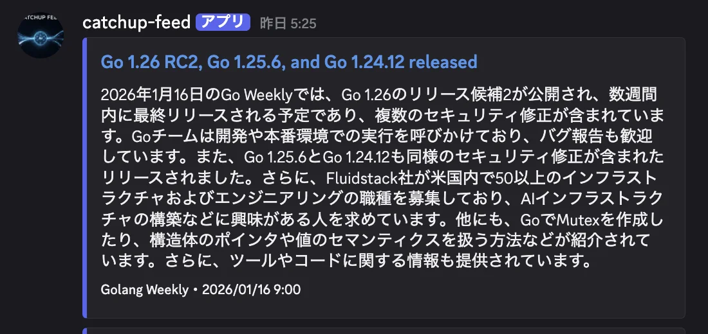
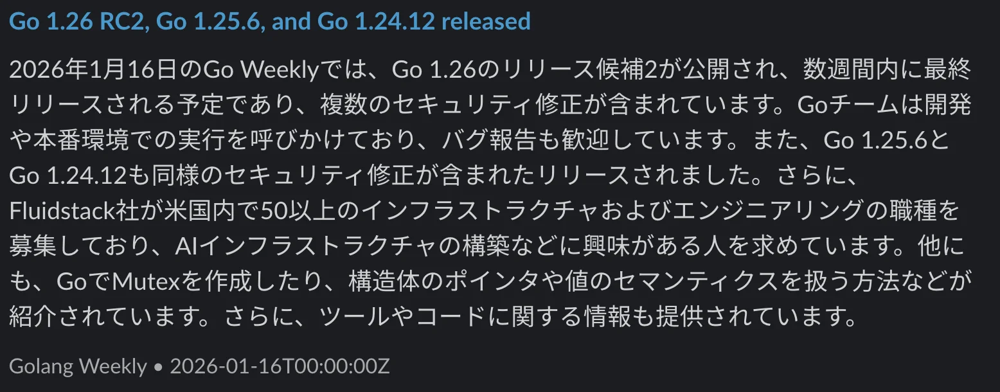
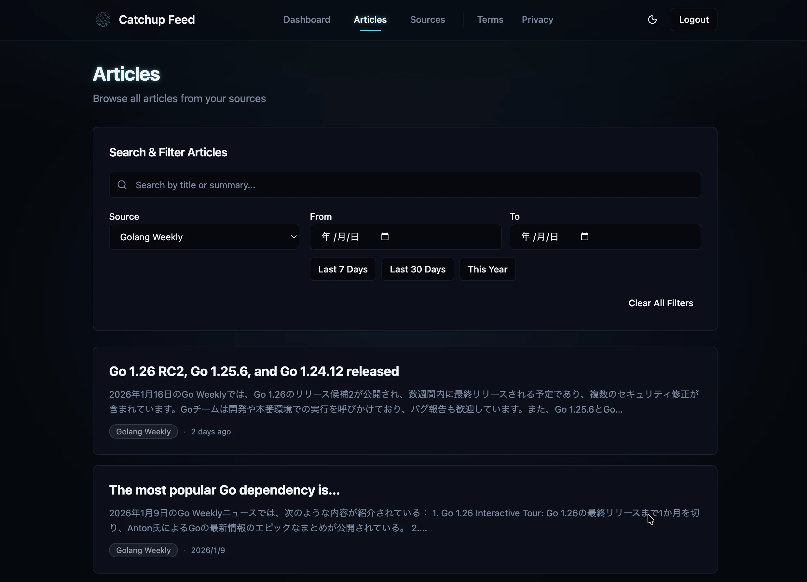
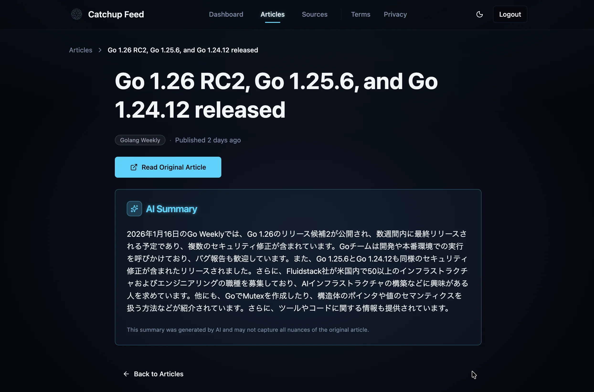
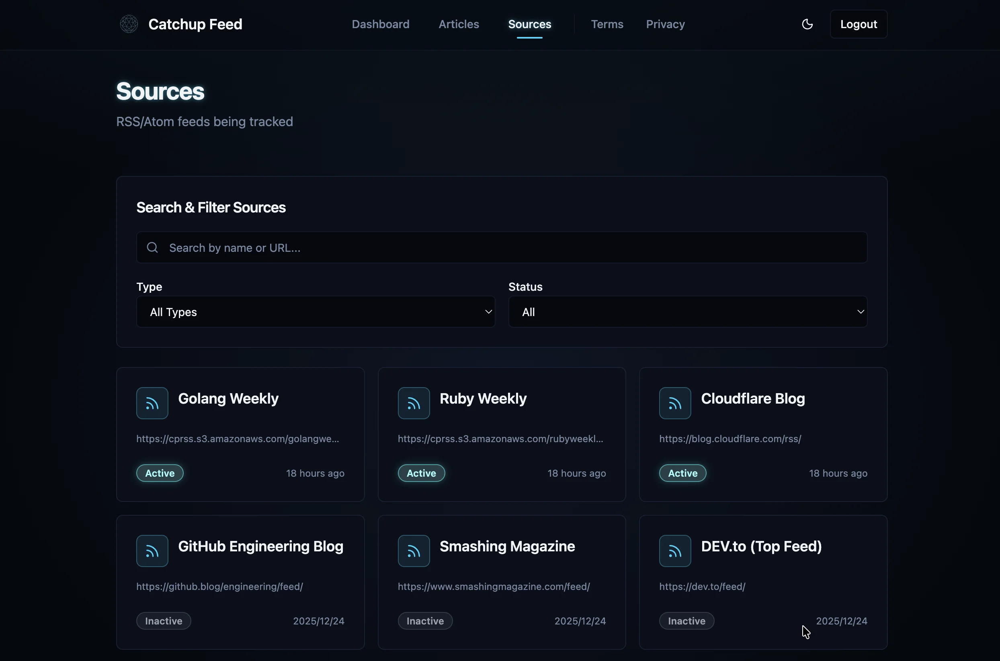

# catchup-feed

> RSS/Atomフィードを自動クロールし、AIで要約を生成するバックエンドシステム

---

## 📸 スクリーンショット

### 通知機能

| Discord | Slack |
|:-------:|:-----:|
|  |  |

### Web UI（[catchup-feed-frontend](https://github.com/Tsuchiya2/catchup-feed-frontend)）

| 記事一覧 | 記事詳細 | ソース一覧 |
|:-------:|:-------:|:---------:|
|  |  |  |

---

## 📋 プロジェクト概要

**catchup-feed** は、RSS/Atomフィードから記事を自動収集し、Claude/OpenAI APIを使用してAI要約を生成、REST APIで提供するバックエンドシステムです。

### 開発の背景・目的

日々大量に発信される技術記事やニュースを効率的にキャッチアップするため、AIによる自動要約機能を持つフィードリーダーのバックエンドとして開発しました。

### 主な特徴

- **クリーンアーキテクチャ採用**: 保守性・テスタビリティを重視した設計
- **AI要約機能**: Claude/OpenAI APIによる記事の自動要約生成
- **コンテンツ強化**: RSSの要約のみの記事は元記事から全文取得してAI要約品質を向上
- **マルチチャネル通知**: Discord/Slack連携（拡張可能な設計）
- **本番運用品質**: サーキットブレーカー、レート制限、Prometheusメトリクス対応
- **実稼働中**: Raspberry Pi 5 + Cloudflare Tunnelで本番運用（[デモサイト](#-本番環境)）

---

## 🛠️ 使用技術

### バックエンド

| カテゴリ | 技術 |
|---------|------|
| **言語** | Go 1.25.4 |
| **データベース** | PostgreSQL 18 / SQLite（テスト用） |
| **HTTPルーター** | 標準ライブラリ（net/http） |
| **認証** | JWT（golang-jwt/jwt/v5） |
| **AI API** | Anthropic Claude（Sonnet 4.5） / OpenAI（GPT-4o-mini） |
| **RSS解析** | mmcdole/gofeed |
| **スケジューラ** | robfig/cron/v3 |
| **監視** | Prometheus / Grafana |
| **ドキュメント** | Swagger（swaggo/swag） |

### 開発環境・ツール

| カテゴリ | 技術 |
|---------|------|
| **コンテナ** | Docker / Docker Compose |
| **CI/CD** | GitHub Actions |
| **静的解析** | golangci-lint / go vet |
| **テスト** | 標準testing / testify |

---

## 🏗️ アーキテクチャ

### クリーンアーキテクチャ

```text
┌────────────────────────────────┐
│ プレゼンテーション層            │ ← cmd/api, internal/handler/http
│ （HTTPハンドラー）              │
├────────────────────────────────┤
│ ユースケース層                  │ ← internal/usecase
│ （ビジネスロジック）            │
├────────────────────────────────┤
│ ドメイン層                      │ ← internal/domain/entity
│ （エンティティ）                │
├────────────────────────────────┤
│ インフラストラクチャ層          │ ← internal/infra
│ （DB、外部API）                 │
└────────────────────────────────┘
```

**依存方向**: 外側 → 内側（プレゼンテーション → ユースケース → ドメイン）

### 設計原則

1. **依存性逆転の原則**: インターフェースを活用し、外部依存を抽象化
2. **ドメイン層の独立性**: 外部ライブラリへの依存を排除
3. **単一責任の原則**: 各ユースケースは1つの責務のみ担当
4. **テスタビリティ**: モックを使った単体テストが容易な設計

---

## 📁 ディレクトリ構成

```text
catchup-feed/
├── cmd/
│   ├── api/                  # APIサーバー（ポート8080）
│   └── worker/               # バッチクローラー（定期実行）
├── internal/
│   ├── config/               # 設定管理
│   ├── domain/
│   │   └── entity/           # ドメインエンティティ（Article, Source, User）
│   ├── repository/           # リポジトリインターフェース
│   ├── service/
│   │   └── auth/             # 認証サービス
│   ├── usecase/              # ビジネスロジック層
│   │   ├── article/          # 記事ユースケース
│   │   ├── source/           # ソースユースケース
│   │   ├── fetch/            # フィード取得・要約生成
│   │   └── notify/           # マルチチャネル通知
│   ├── handler/http/         # HTTPハンドラー
│   │   ├── auth/             # 認証ハンドラー・JWT検証
│   │   ├── article/          # 記事ハンドラー
│   │   ├── source/           # ソースハンドラー
│   │   └── middleware/       # ミドルウェア（CORS、レート制限等）
│   ├── infra/
│   │   ├── adapter/          # 永続化アダプタ（SQLite実装）
│   │   ├── db/               # データベース接続・マイグレーション
│   │   ├── summarizer/       # 要約エンジン（Claude, OpenAI）
│   │   ├── scraper/          # RSS/Atom解析
│   │   ├── fetcher/          # コンテンツ取得（Readability）
│   │   └── notifier/         # 通知（Discord, Slack）
│   ├── observability/        # 監視（ロギング、メトリクス、トレーシング）
│   ├── resilience/           # 耐障害性（サーキットブレーカー、リトライ）
│   └── pkg/                  # 共通パッケージ（バリデーション等）
├── config/                   # 設定ファイル（Prometheus、Grafana等）
├── pkg/                      # 公開パッケージ（レート制限、セキュリティ）
├── scripts/                  # 運用スクリプト（バックアップ、ヘルスチェック）
├── tests/                    # テスト（E2E、統合、パフォーマンス）
├── docs/                     # プロジェクトドキュメント
└── .claude/                  # Claude Code設定
```

---

## 📱 主要機能

### 1. フィード自動収集・要約生成

- 登録されたRSS/Atomフィードを定期クロール（デフォルト: 毎日5:30 AM）
- 並列処理によるフィード取得の最適化
- URL重複検知による記事の重複防止
- Claude/OpenAI APIによる自動要約生成

### 2. コンテンツ強化機能

RSSフィードの内容が不十分な場合（要約のみの記事など）、元記事からフルテキストを自動取得してAI要約の品質を向上させる機能を実装しています。

**技術的なポイント**:
- Mozilla Readabilityアルゴリズムで記事本文を抽出
- SSRF防止: プライベートIPアクセスをブロック
- サイズ制限・タイムアウト・リダイレクト制限によるセキュリティ対策

### 3. 認証・認可

- JWT認証によるセキュアなAPI
- ロールベースアクセス制御（Admin / Viewer）
- 強力なパスワードポリシー（12文字以上、弱いパターン検出）

### 4. エピソード通知（設計書 §7）

通知の単位は記事ではなく**エピソード**（旧システムの per-article 通知は
最適化目標の転換により廃止）。radio バッチが jobs テーブルに `notify_episode`
を積み、worker のコンシューマが Destination interface（D-7）経由で配信する。

```text
jobs テーブル（PostgreSQL、C-4）
   │  notify_episode / notify_error
   ▼
worker コンシューマ ── リトライは jobs の attempts 上限 3（§7）
   │
   ├─ Discord Webhook（本人、mp3 10MB 未満は直接添付）
   ├─ Slack Webhook（本人）
   └─ SMTP メール（友人、公開エピソードのみ、C-11）
```

### 5. 監視・可観測性

- slog による構造化ロギング（JSON）
- ヘルスチェックエンドポイント
- フォールバック発生は summaries.provider / jobs.last_error で事後観測（§8）

---

## 🚀 クイックスタート

### 前提条件

- Docker / Docker Compose
- Claude または OpenAI のAPIキー

### セットアップ

```bash
# 1. 環境変数を設定
cp .env.example .env
# .env を編集し、APIキー等を設定

# 2. 開発環境を起動
make setup

# 3. 開発コンテナに入る
make dev-shell

# 4. テスト実行
go test ./...

# 5. 静的解析
golangci-lint run
```

### Swagger ドキュメント生成

ハンドラのアノテーションを変更したら `docs/` を再生成する（frontend の型生成が
この出力に依存する）。CI と同じバージョンの swag（go.mod で固定）が使われる。

```bash
make swagger
```

### アクセス

| サービス | URL | 説明 |
|---------|-----|------|
| API | <http://localhost:8080> | REST API |
| Swagger UI | <http://localhost:8080/swagger/index.html> | APIドキュメント |
| Prometheus | <http://localhost:9090> | メトリクス |
| Grafana | <http://localhost:3000> | ダッシュボード |

---

## 📡 API概要

### 認証

```bash
# トークン取得
curl -X POST http://localhost:8080/auth/token \
  -H "Content-Type: application/json" \
  -d '{"username":"admin","password":"your-password"}'
```

### 主要エンドポイント

| メソッド | エンドポイント | 説明 |
|---------|---------------|------|
| POST | `/auth/token` | 認証トークン取得 |
| GET | `/sources` | フィードソース一覧 |
| POST | `/sources` | フィードソース登録 |
| GET | `/articles` | 記事一覧（要約付き） |
| GET | `/health` | ヘルスチェック |
| GET | `/metrics` | Prometheusメトリクス |

詳細は [Swagger UI](http://localhost:8080/swagger/index.html) を参照してください。

---

## 🔧 設定

### 必須環境変数

| 項目 | 説明 |
|------|------|
| `DATABASE_URL` | PostgreSQL接続文字列 |
| `JWT_SECRET` | JWT署名用秘密鍵（32文字以上） |
| `ADMIN_USER` | 管理者ユーザー名（単一管理者、C-7） |
| `ADMIN_PASSWORD_HASH` | 管理者パスワードの bcrypt ハッシュ（下記参照） |

#### 管理者パスワードハッシュの生成

サーバーには平文パスワードを置かず、bcrypt ハッシュのみを環境変数に設定します（C-7/C-20）。

```bash
# 対話的に生成（パスワードは12文字以上72バイト以下、コスト12で生成）
make admin-hash

# または stdin から
printf '%s' 'your-password' | go run ./cmd/hash-password
```

出力されたハッシュを `ADMIN_PASSWORD_HASH` に設定してください。
docker compose が読み込む `.env` に書く場合は、ハッシュに含まれる `$` を
`$$` にエスケープする必要があります（例: `$2a$12$...` → `$$2a$$12$$...`）。

### 要約エンジン（フォールバック連鎖: Gemini → Groq → Ollama）

API キーが設定されたプロバイダのみ連鎖に組み込まれ、上から順に試行されます。
全プロバイダが失敗した記事は未要約のまま次回クロールに持ち越されます。

| 環境変数 | 説明 | デフォルト |
|----------|------|-----------|
| `GEMINI_API_KEY` | Google AI Studio（無料枠）API キー。未設定なら連鎖から除外 | — |
| `GEMINI_MODEL` | Gemini モデル | `gemini-2.5-flash` |
| `GROQ_API_KEY` | Groq（無料枠）API キー。未設定なら連鎖から除外 | — |
| `GROQ_MODEL` | Groq モデル | `llama-3.3-70b-versatile` |
| `OLLAMA_ENABLED` | ローカル Ollama を最終フォールバックとして使う（`false` で除外） | `true` |
| `OLLAMA_HOST` | Ollama エンドポイント。worker をコンテナ/Pi で動かす場合、デフォルトはコンテナ自身を指すため tailnet 上の Mac のアドレス指定が必須 | `http://localhost:11434` |
| `OLLAMA_MODEL` | Ollama モデル（事前に `ollama pull` が必要） | `qwen2.5:7b` |
| `SUMMARIZER_CHAR_LIMIT` | 要約の文字数上限（100〜5000） | `900` |
| `SUMMARIZER_TIMEOUT` | プロバイダ1回あたりのタイムアウト（Go duration 形式） | `60s` |

### フィード配信（設計書 §5）

公開フィードは `GET /feeds/{token}/feed.xml`（トークン認証、Cloudflare Tunnel 経由）、
私的フィードは `GET /private/feed.xml`（認証なし、tailnet バインドの別リスナー）。
mp3 の URL もトークンパス配下（C-9）で、Range リクエストに対応する（C-10）。

| 環境変数 | 説明 | デフォルト |
|----------|------|-----------|
| `FEED_PUBLIC_BASE_URL` | 公開フィード・enclosure URL のベース（D-6） | `https://radio.catchup-feed.com` |
| `FEED_PRIVATE_BASE_URL` | 私的フィードの enclosure URL ベース。未設定ならリクエストの Host から導出 | — |
| `FEED_AUDIO_DIR` | エピソード mp3 の格納ディレクトリ。この外を指す audio_path は配信しない | `episodes` |
| `FEED_CHANNEL_TITLE` | RSS チャンネルタイトル | `pulse radio` |
| `FEED_CHANNEL_DESCRIPTION` | RSS チャンネル説明 | `毎朝の技術ニュースラジオ` |
| `FEED_MAX_ITEMS` | フィードに載せる最大エピソード数 | `30` |
| `PRIVATE_FEED_ADDR` | 私的フィードリスナーの bind アドレス。**必ず tailnet の IP:port を明示すること**。`:8081` や `0.0.0.0:8081` は無認証の私的エピソードを LAN 全体に露出するため、server が検出して私的リスナーの起動を拒否する（公開側は通常起動）。未設定なら私的リスナーを起動しない | — |

> **注意（Cloudflare Tunnel 背後での運用）**: 公開フィードのレート制限は
> per-IP のため、trusted proxy 設定（`RATE_LIMIT_TRUST_PROXY=true` +
> `RATE_LIMIT_TRUSTED_PROXIES`）が必須。未設定だとすべてのクライアントが
> Tunnel の接続元 IP ひとつに束ねられ、単一のレートバケットを共有して
> しまい、正規の購読者が巻き添えで 429 になる。

### ラジオ生成バッチ（cmd/radio、設計書 §6）

Mac の夜間バッチ（launchd、04:30 JST 想定）。tailnet 越しに Pi の PostgreSQL へ
直接接続する（`DATABASE_URL`）。台本生成の LLM は要約と同一のフォールバック連鎖
（D-3、上記の Gemini/Groq/Ollama 設定を共有）。記事ゼロの日はスキップ（D-1）、
VOICEVOX・ffmpeg・rsync の失敗は当日スキップでエラー終了し、翌日 launchd が再試行
する（§8）。`-dry-run` で台本生成まで実行して stdout に出力（話者・プロンプト調整用、
D-2）、`-since <RFC3339>` で記事選定カーソルを上書きできる。

| 環境変数 | 説明 | デフォルト |
|----------|------|-----------|
| `RADIO_SHOW_NAME` | 番組名（エピソードタイトル・プロンプト・ID3 タグに使用） | `pulse` |
| `RADIO_MAX_ARTICLES` | 1エピソードで紹介する記事の上限。超過分はショーノートにリンクのみ（§6-1） | `8` |
| `RADIO_TIMEZONE` | 放送日の基準タイムゾーン（タイトル・rev 判定） | `Asia/Tokyo` |
| `RADIO_EPISODES_DIR` | Pi 側のエピソード格納ディレクトリ（episodes.audio_path に記録） | `/data/episodes` |
| `RADIO_RSYNC_DEST` | rsync 転送先（例 `pi@pi.tailnet:/data/episodes`）。未設定なら `RADIO_EPISODES_DIR` へ直接コピーするローカル完結モード | — |
| `RADIO_RSYNC_PATH` | rsync バイナリのパス | `rsync` |
| `RADIO_TIMEOUT` | バッチ全体のタイムアウト（Go duration 形式）。Ollama のみの縮退運転で台本生成が長引く場合は延長する | `1h` |
| `FFMPEG_PATH` | ffmpeg バイナリのパス（Mac は brew の ffmpeg 前提） | `ffmpeg` |
| `VOICEVOX_URL` | VOICEVOX Engine のエンドポイント | `http://127.0.0.1:50021` |
| `VOICEVOX_SPEAKER` | 話者スタイル ID。仮話者は 3（ずんだもん ノーマル）、耳での選定は後日（D-2） | `3` |
| `VOICEVOX_SPEED_SCALE` | 話速倍率（D-2） | `1.0` |
| `VOICEVOX_TIMEOUT` | 1文あたりの合成タイムアウト（Go duration 形式） | `120s` |

同一日の再実行は既存エピソードを上書きせず、タイトルとファイル名に `rev2`, `rev3`…
を付けた新規版になる（§6-6）。既に放送済み（segments に載った）記事は、再実行や
`-since` の巻き戻しでも再選定されない。生成の中間ファイルはテンポラリディレクトリ内で
完結し、DB への書き込み（episodes/segments INSERT と `regenerate_feed` /
`notify_episode` ジョブ投入）は mp3 の転送成功後のみ行われる。なお episodes INSERT
成功後のジョブ投入が失敗した場合、フィード反映・通知は翌日の成功実行まで遅れる
（§8 の縮退範囲として許容）。

### 通知とジョブ処理（worker、設計書 §3.3 / §7）

worker は jobs テーブルのコンシューマを常駐させ、radio バッチが積んだ
`regenerate_feed` / `notify_episode` / `notify_error` と、日次で自分が積む
`cleanup_old_media`（D-4: mp3 は直近45日保持）を処理する。失敗ジョブは
attempts 上限 3 でリトライし（§7）、worker クラッシュで running のまま残った
ジョブは次回起動時に pending へ掃き戻される。通知チャネルは本人= Discord/Slack
（D-7、`*_ENABLED` で宣言的に有効化）、友人=メール（C-11、公開エピソードのみ。
購読 URL はハッシュ保存のため本文に含められず、新着案内のみ）。`notify_error`
は best-effort で、通知自体の失敗はリトライしない（§8）。

| 環境変数 | 説明 | デフォルト |
|----------|------|-----------|
| `JOBS_POLL_INTERVAL` | jobs テーブルのポーリング間隔（Go duration 形式） | `10s` |
| `CLEANUP_CRON_SCHEDULE` | `cleanup_old_media` を積む cron 式（radio の 04:30 より後にする） | `30 6 * * *` |
| `DISCORD_ENABLED` | Discord 通知を有効化（`true` のみ） | `false` |
| `DISCORD_WEBHOOK_URL` | Discord Webhook URL（https / discord.com / /api/webhooks/ を検証） | — |
| `SLACK_ENABLED` | Slack 通知を有効化（`true` のみ） | `false` |
| `SLACK_WEBHOOK_URL` | Slack Incoming Webhook URL（https / hooks.slack.com / /services/ を検証） | — |
| `SMTP_ENABLED` | 友人向けメール通知を有効化（`true` のみ） | `false` |
| `SMTP_HOST` | SMTP サーバ（例 `smtp.gmail.com`。ゼロ円原則: 既存の無料 SMTP を使う） | — |
| `SMTP_PORT` | SMTP ポート。465 は implicit TLS、それ以外は STARTTLS を試行 | `587` |
| `SMTP_USERNAME` | SMTP 認証ユーザー（Gmail ならメールアドレス）。空なら AUTH なし | — |
| `SMTP_PASSWORD` | SMTP パスワード（Gmail はアプリパスワード） | — |
| `SMTP_FROM` | 送信元アドレス | `SMTP_USERNAME` |

公開エピソードの mp3 が 10MB 未満なら Discord に直接添付される（§7）。
本人通知のエピソードリンクには `FEED_PRIVATE_BASE_URL` を使う（未設定ならリンクなし）。

詳細な設定項目は `.env.example` を参照してください。

---

## 🎯 開発ガイドライン

### コーディング規約

- **クリーンアーキテクチャ準拠**: 依存方向を厳守（外側 → 内側）
- **ドメイン層の独立性**: 外部依存を持たない（標準ライブラリのみ）
- **テストカバレッジ**: 70%以上を維持
- **静的解析**: go fmt / goimports / go vet / golangci-lint

### エラーハンドリング

```go
// コンテキスト情報を付与
if err != nil {
    return fmt.Errorf("failed to create article: %w", err)
}
```

### ブランチ命名規則

- `feature/XXX` - 新機能
- `fix/XXX` - バグ修正
- `hotfix/XXX` - 緊急修正

---

## 🌐 本番環境

### デモサイト

本プロジェクトは**実際に稼働しているサービス**です。

| 環境 | URL |
|------|-----|
| **フロントエンド** | [pulse.catchup-feed.com](https://pulse.catchup-feed.com) |
| **バックエンドAPI** | [catchup.catchup-feed.com](https://catchup.catchup-feed.com) |

### インフラ構成

```text
┌─────────────────────────────────────────────────────────────────────────┐
│                         catchup-feed.com                                │
│                      (Cloudflare DNS Zone)                              │
├─────────────────────────────────────────────────────────────────────────┤
│                                                                         │
│  ┌───────────────────────┐         ┌───────────────────────┐           │
│  │pulse.catchup-feed.com │         │catchup.catchup-feed.com│           │
│  │       (CNAME)         │         │       (CNAME)          │           │
│  │          ↓            │         │          ↓             │           │
│  │    Vercel Edge        │         │   Cloudflare Tunnel    │           │
│  │    (Next.js SSR)      │         │          ↓             │           │
│  │                       │         │    Raspberry Pi 5      │           │
│  │ catchup-feed-frontend │←───────→│ catchup-feed-backend   │           │
│  │      (Frontend)       │   API   │   (Go API + Claude)    │           │
│  └───────────────────────┘         └───────────────────────┘           │
│                                              │                          │
│                                              ▼                          │
│                                     ┌─────────────────┐                 │
│                                     │   PostgreSQL    │                 │
│                                     └─────────────────┘                 │
│                                                                         │
└─────────────────────────────────────────────────────────────────────────┘
```

### 技術的なポイント

| 項目 | 内容 |
|------|------|
| **ホスティング** | Raspberry Pi 5（8GB）でGoバックエンド + PostgreSQLを運用 |
| **セキュア公開** | Cloudflare Tunnelでポート開放なしにインターネット公開 |
| **フロントエンド** | Vercel Edge Networkによるグローバルな CDN配信 |
| **SSL/TLS** | Cloudflare / Vercelによる自動証明書管理 |
| **CI/CD** | GitHub Actionsによる自動テスト・デプロイ |

### なぜRaspberry Pi 5？

- **低コスト運用**: クラウドサービスの月額費用を抑えながら本番運用
- **学習目的**: インフラ構築からデプロイまで一貫した経験
- **実用性の証明**: 軽量なGoバックエンドは低スペック環境でも十分なパフォーマンス

---

## 📚 ドキュメント

| ドキュメント | 説明 |
|------------|------|
| [docs/architecture.md](docs/architecture.md) | システムアーキテクチャ |
| [docs/development-guidelines.md](docs/development-guidelines.md) | 開発ガイドライン |
| [docs/functional-design.md](docs/functional-design.md) | 機能設計 |
| [CHANGELOG.md](CHANGELOG.md) | 変更履歴 |

---

## 📄 ライセンス

MITライセンス - 詳細は [LICENSE](LICENSE) を参照

---

**最終更新**: 2026-01-18
